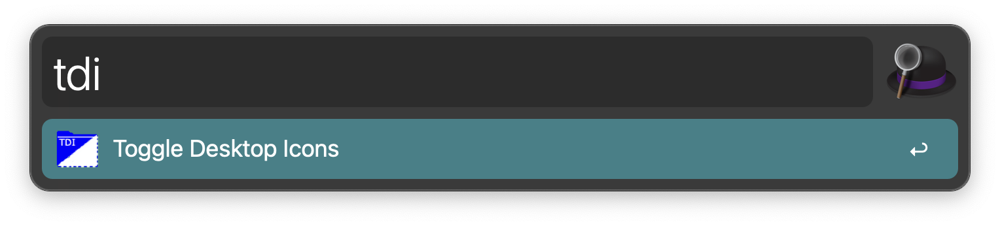

# Toggle Desktop Icons
 TDI is an [Alfred](https://www.alfredapp.com) Workflow to toggle the visibility of the icons on the desktop.

Alfred screenshot.  

Deskop with icons.  

Desktop without icons.  
