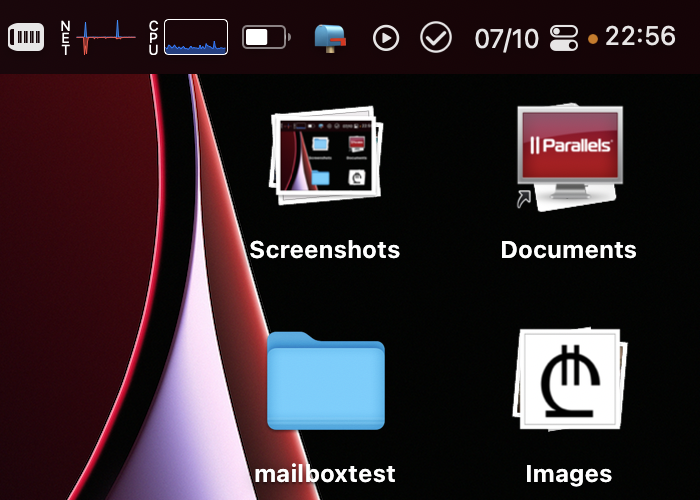

# Toggle Desktop Icons
 TDI is an [Alfred](https://www.alfredapp.com) Workflow to toggle the visibility of the icons on the desktop.

Alfred screenshot.  

Deskop with icons.  

Desktop without icons.  

## Instalation
Download the latest release from the [Releases page](https://github.com/larkov/ToggleDesktopIcons-AlfredWorkflow/releases) and click on the downloaded file and Alfred should take care of it.

If the icons reappear after the first toggle just run it once more.
